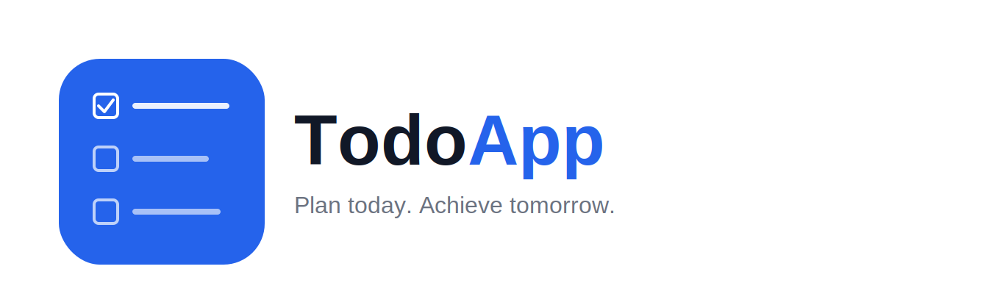

# TodoApp

A simple, secure todo list app built with ASP.NET Core Razor Pages. Sign up, log in (with a password or your Google account), and manage your personal todo list — every user only ever sees their own items.

**Live app:** [todoapp.com.au](https://todoapp.com.au)



## Features

- **Account system** built on ASP.NET Core Identity — sign up with first name, last name, username, and password
- **Google OAuth sign-in** — log in with your Google account, automatically linked to your email if you already have a password account
- **Per-user todo lists** — add, edit, toggle complete, and delete todos, scoped strictly to the logged-in user
- **Responsive UI** built with Bootstrap 5 and Bootstrap Icons
- Served over **HTTPS** on a custom domain via a CloudFront + Elastic Beanstalk setup

## Tech stack

| Layer | Technology |
|---|---|
| Framework | ASP.NET Core Razor Pages (.NET 8) |
| Auth | ASP.NET Core Identity + Google OAuth |
| Database | PostgreSQL (via Entity Framework Core / Npgsql) |
| Hosting | AWS Elastic Beanstalk |
| Database hosting | AWS RDS (PostgreSQL) |
| CDN / HTTPS | AWS CloudFront + AWS Certificate Manager |
| DNS | Cloudflare |
| Frontend | Razor views, Bootstrap 5, Bootstrap Icons, vanilla JS |

## Architecture

```
Browser
   │  HTTPS
   ▼
CloudFront (CDN + SSL termination, custom domain)
   │  HTTP
   ▼
Elastic Beanstalk (ASP.NET Core app, EC2)
   │
   ▼
RDS PostgreSQL (per-user data, Identity tables)
```

DNS for the custom domain is managed through Cloudflare (in "DNS only" mode — Cloudflare's proxy/CDN features are disabled, since CloudFront handles that role).

## Getting started locally

### Prerequisites

- [.NET 8 SDK](https://dotnet.microsoft.com/download)
- [PostgreSQL](https://www.postgresql.org/download/) running locally
- A [Google Cloud OAuth client](https://console.cloud.google.com/) (optional, only needed to test Google sign-in)

### Setup

1. **Clone the repo**
   ```bash
   git clone https://github.com/<your-username>/TodoAppWithLogin.git
   cd TodoAppWithLogin
   ```

2. **Configure your local secrets** (never committed to source control)
   ```bash
   dotnet user-secrets init
   dotnet user-secrets set "ConnectionStrings:DefaultConnection" "Host=localhost;Database=TodoApp;Username=postgres;Password=your-local-password"
   dotnet user-secrets set "Authentication:Google:ClientId" "your-client-id"
   dotnet user-secrets set "Authentication:Google:ClientSecret" "your-client-secret"
   ```

3. **Create the local database and apply migrations**
   ```sql
   CREATE DATABASE "TodoApp";
   ```
   ```bash
   dotnet ef database update
   ```

4. **Run the app**
   ```bash
   dotnet run
   ```
   The app will be available at the HTTPS URL shown in the console (e.g. `https://localhost:7011`).

## Project structure

```
Pages/
├── Index.cshtml            Home / greeting page
├── Account/
│   ├── Register.cshtml     Sign up
│   ├── Login.cshtml        Log in (password + Google)
│   ├── ExternalLoginCallback.cshtml   Handles the OAuth redirect back from Google
│   └── Logout.cshtml       Sign out
└── Todos/
    ├── Index.cshtml        Main todo list (add, toggle, delete)
    └── Edit.cshtml         Edit a single todo
Models/                     ApplicationUser (Identity) and Todo entities
Data/                       EF Core DbContext
```

## Deployment

The app is deployed to AWS Elastic Beanstalk (single-instance, `.NET on Linux`), with the database on RDS PostgreSQL. To deploy a new version:

1. Publish a Release build to a local folder (Visual Studio: right-click project → Publish → Folder)
2. Zip the contents of the publish folder (not the folder itself)
3. Upload the zip via the Elastic Beanstalk console → **Upload and deploy**

Connection strings and OAuth secrets are set as Elastic Beanstalk environment properties (`ConnectionStrings__DefaultConnection`, `Authentication__Google__ClientId`, `Authentication__Google__ClientSecret`) — never committed to this repo.

## Roadmap

- [x] Google OAuth sign-in
- [ ] GitHub OAuth sign-in
- [ ] Forgot password / email-based password reset
- [ ] Nicer inline todo editing

## License

This project is open source under the [MIT License](LICENSE).

## Contributing

Issues and pull requests are welcome — this started as a personal learning project and is shared in case it's useful to others building something similar with Razor Pages, Identity, and AWS.
